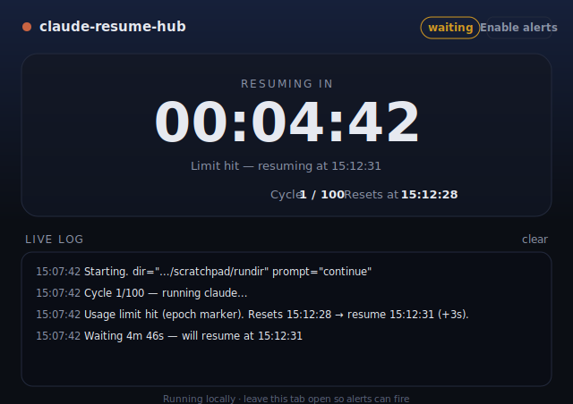

# claude-resume-hub

> Run [Claude Code](https://docs.claude.com/en/docs/claude-code), and when you hit a usage/session limit it **waits until the exact reset time and continues automatically** — with a live dashboard and desktop alerts so you can walk away entirely.

Hit a limit at 2am? Wake up to a finished task.

```bash
npx claude-resume-hub --web
```

Cross-platform (**Windows, macOS, Linux**), zero-install, zero-dependency.

<p align="center">
  
</p>

---

## Why this exists

When Claude Code hits your subscription limit it prints something like:

```
Claude AI usage limit reached|1784376612
```

…and **stops**. It won't wait and continue on its own — you have to come back and type `continue`. If the window resets at 3am, your work just sits there.

`claude-resume-hub` wraps the CLI, detects the limit, reads the **exact reset time** from the message, sleeps until then, and continues for you — looping until the task is actually done.

## The dashboard (`--web`)

Most tools for this are terminal-only. Run with `--web` and you get a **live local dashboard**:

- ⏱️ **Big countdown** to the exact resume time
- 🔔 **Desktop notifications** when the limit resets, when it resumes, and when the task completes — so you can close the terminal and go do something else
- 📜 **Live streaming log** and cycle counter
- Pure `localhost`, no data leaves your machine, no dependencies

```bash
npx claude-resume-hub --web
```

Leave the tab open and walk away. It'll ping you the moment your task is moving again.

## Usage

```bash
# Keep the latest session in this folder going across limit resets:
npx claude-resume-hub

# ...with the live dashboard + desktop alerts:
npx claude-resume-hub --web

# Kick off a long task and let it ride through every limit until it finishes:
npx claude-resume-hub --web -t "refactor the auth module and run the full test suite"

# Forward extra flags straight to claude (everything after --):
npx claude-resume-hub -- --model opus
```

Install globally if you'll use it a lot (adds the `crh` alias):

```bash
npm install -g claude-resume-hub
claude-resume-hub --web       # or: crh --web
```

## How it works

```
┌─ run  claude -c -p "continue"   (output streams live)
│
├─ scan output for a usage-limit signal
│     ├─ no limit + clean exit ─────────────▶  task complete ✅
│     ├─ no limit + error exit ─────────────▶  stop & surface it (auth/network/…)
│     └─ limit hit:
│           ├─ "…limit reached|<epoch>"  ──▶  exact reset time  ┐
│           ├─ "resets 3:45pm"           ──▶  parsed clock time ├─▶ sleep till then (+buffer)
│           └─ limit phrase, no time     ──▶  poll every N min  ┘
│
└─ wake up ──▶ loop   (dashboard + notifications reflect every step)
```

## Options

| Flag | Default | Description |
|------|---------|-------------|
| `-p, --prompt <text>` | `continue` | Message sent to resume after a reset |
| `-t, --task <text>` | — | Initial task; starts a fresh session first, then continues it |
| `-d, --dir <path>` | current dir | Working directory / project |
| `-w, --web` | off | Open the live dashboard with desktop alerts |
| `--port <n>` | `4177` | Dashboard port |
| `--no-open` | | Don't auto-open the browser |
| `-b, --buffer <seconds>` | `30` | Safety margin added after the reset time |
| `--poll <minutes>` | `5` | Retry interval if a reset time can't be determined |
| `-m, --max-cycles <n>` | `100` | Max limit → wait → continue cycles |
| `--verbose` | | Print detection diagnostics |
| `-h, --help` / `-v, --version` | | Help / version |

## Requirements

- [Claude Code](https://docs.claude.com/en/docs/claude-code) installed, on your `PATH`, logged in with your Pro/Max subscription (so you hit **subscription** limits, which this handles — not `--bare` API-key mode).
- Node.js ≥ 16 (ships with Claude Code anyway).
- Leave your machine on so it can wake at reset time.

## Notes & caveats

- The primary `…limit reached|<epoch>` marker gives an exact reset time; the prose fallback assumes your local timezone.
- Headless `-c` continues the **most recent** session in the given folder — run it in the right project (`--dir`).
- A non-zero exit **without** a limit marker is treated as a real error (auth, network, bad flags) and stops the loop instead of retrying forever.
- Desktop alerts require the dashboard tab to stay open (that's where the notifications fire from).

## Prior art

Inspired by the bash community tools, notably [terryso/claude-auto-resume](https://github.com/terryso/claude-auto-resume). This project aims to be the cross-platform, `npx`-friendly, dashboard-equipped take that also serves Windows users. Related upstream request: [anthropics/claude-code#36320](https://github.com/anthropics/claude-code/issues/36320).

## Contributing

Issues and PRs welcome. Keep it small and dependency-free. Run tests with `npm test`.

## License

[MIT](LICENSE)
